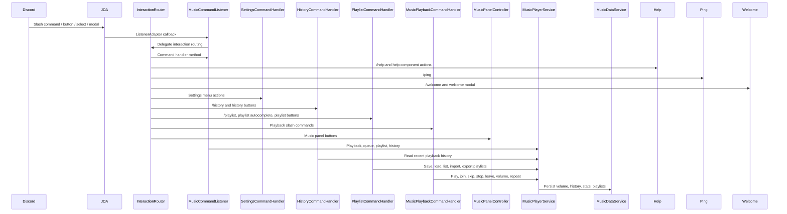
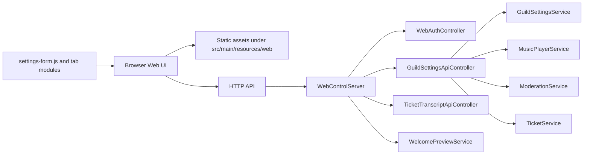
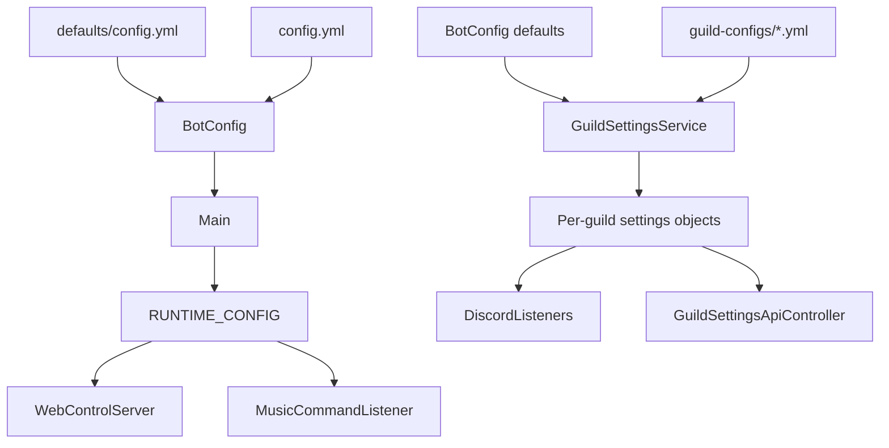
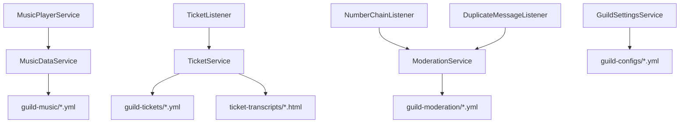

# Architecture

This document describes the current runtime flow for the Discord bot, Web UI,
configuration layer, and persistent data services. It is intended to make the
current structure easier to reason about before splitting large classes into
smaller handlers.

## Runtime Overview

```mermaid
flowchart TD
    Main[bootstrap.Main] --> Config[BotConfig]
    Main --> I18n[I18nService]
    Main --> JDA[JDA]
    Main --> Settings[GuildSettingsService]
    Main --> MusicPlayer[MusicPlayerService]
    Main --> MusicData[MusicDataService]
    Main --> Moderation[ModerationService]
    Main --> Tickets[TicketService]
    Main --> Web[WebControlServer]

    JDA --> Router[InteractionRouter]
    JDA --> MusicListener[MusicCommandListener]
    JDA --> TicketListener[TicketListener]
    JDA --> MessageLogs[MessageLogListener]
    JDA --> ServerLogs[ServerLogListener]
    JDA --> Notifications[NotificationListener]
    JDA --> PrivateRooms[PrivateRoomListener]
    JDA --> NumberChain[NumberChainListener]
    JDA --> Duplicate[DuplicateMessageListener]
    JDA --> VoiceAutoLeave[VoiceAutoLeaveListener]

    Router --> MusicListener
    MusicListener --> HelpHandler[HelpCommandHandler]
    MusicListener --> PingHandler[PingCommandHandler]
    MusicListener --> WelcomeHandler[WelcomeCommandHandler]
    MusicListener --> SettingsHandler[SettingsCommandHandler]
    MusicListener --> HistoryHandler[HistoryCommandHandler]
    MusicListener --> PlaylistHandler[PlaylistCommandHandler]
    MusicListener --> PlaybackHandler[MusicPlaybackCommandHandler]
    MusicListener --> Panel[MusicPanelController]

    MusicListener --> MusicPlayer
    HistoryHandler --> MusicPlayer
    PlaylistHandler --> MusicPlayer
    PlaybackHandler --> MusicPlayer
    Panel --> MusicPlayer
    VoiceAutoLeave --> MusicPlayer
    MusicPlayer --> MusicData

    SettingsHandler --> Settings
    MessageLogs --> Settings
    ServerLogs --> Settings
    Notifications --> Settings
    PrivateRooms --> Settings
    NumberChain --> Moderation
    Duplicate --> Moderation
    TicketListener --> Tickets

    Web --> WebAuth[WebAuthController]
    Web --> WebMetadata[WebMetadataController]
    Web --> WebStatic[WebStaticAssetController]
    WebMetadata --> WebLang[WebLanguageBundleService]
    WebAuth --> WebSession[WebSessionManager]
    WebAuth --> DiscordOAuth[DiscordOAuthClient]
    GuildApi --> WebSession
    Web --> GuildApi[GuildSettingsApiController]
    Web --> TicketApi[TicketTranscriptApiController]
    Web --> WelcomePreview[WelcomePreviewService]
    GuildApi --> Settings
    GuildApi --> MusicPlayer
    GuildApi --> Moderation
    GuildApi --> Tickets
```

## Discord Flow

Current notes:

- `MusicCommandListener` is the largest coordination class. It owns slash command
  registration helpers, command handlers, playlist UI, legacy text commands,
  panel refresh helpers, and several formatting utilities.
- `InteractionRouter` centralizes interaction dispatch but still routes many
  actions back into `MusicCommandListener`.
- `SettingsCommandHandler` is already split out and is the preferred pattern for
  future command-specific handlers.
- `HelpCommandHandler` owns `/help`, legacy text `help`, help category select,
  and help category buttons.
- `PingCommandHandler` owns `/ping` latency embed behavior.
- `WelcomeCommandHandler` owns `/welcome`, the welcome edit modal, and Discord
  welcome settings responses.
- `HistoryCommandHandler` owns `/history`, the legacy text `history` embed,
  pagination buttons, embed formatting, and repeated-entry compaction.
- `PlaylistCommandHandler` now owns the public playlist routing boundary,
  playlist autocomplete, playlist list pagination UI, and playlist view
  pagination state/UI, remove-track confirmation state/UI, and playlist
  save/load/delete/import/export behavior.
- `MusicPlaybackCommandHandler` owns the public playback routing boundary for
  slash and legacy text commands. It also owns volume and repeat behavior for
  slash/text commands, join/skip/stop/leave behavior, and play/search-pick
  behavior.
- `MusicPanelController` is already split out and should continue owning panel
  button behavior where possible.

## Web UI Flow

Current notes:

- `WebControlServer` owns HTTP server lifecycle, session handling, static asset
  serving, and controller wiring.
- `WebMetadataController` owns lightweight Web metadata routes such as
  `/api/guilds` and `/api/web/i18n`.
- `WebStaticAssetController` owns the root Web HTML assembly and static assets
  under `/web/`.
- `WebLanguageBundleService` owns loading and flattening Web UI language bundles
  from runtime files and bundled defaults.
- `WebSessionManager` owns OAuth state storage, Web session storage, session
  cookie handling, and expired session cleanup.
- `DiscordOAuthClient` owns Discord OAuth/profile/guild HTTP API calls used by
  the Web login and guild picker.
- `GuildSettingsApiController` maps Web UI payloads into runtime settings and
  service calls.
- `settings-form.js` contains the section schema that maps DOM control IDs to
  payload paths. This is useful, but it is becoming dense as each settings tab
  grows.
- Web language strings are separate from Discord language strings under
  `defaults/lang/web/`.

## Configuration Flow

Current notes:

- Global bot configuration is loaded by `BotConfig`.
- Per-guild mutable configuration is managed by `GuildSettingsService`.
- Runtime reload updates `RUNTIME_CONFIG`, refreshes command/listener settings,
  and syncs the Web server lifecycle.
- Language files are loaded by `I18nService`; corrupted or missing files fall
  back to bundled defaults.

## Data Service Flow

Current notes:

- `MusicDataService` stores volume, playback history, music stats, saved
  playlists, playlist import/export state, and playlist track data.
- `TicketService` stores ticket records and writes transcript HTML.
- `ModerationService` stores number-chain state, warnings, and duplicate-message
  moderation state.
- `GuildSettingsService` stores feature settings such as notification channels,
  Web-editable logs, music settings, private-room settings, ticket settings, and
  language.

## Suggested Split Plan

1. Extract `HistoryCommandHandler` (done)
   - Own `/history`, history pagination buttons, history embed formatting, and
     history compaction.

2. Extract `PlaylistCommandHandler` (done)
   - Own playlist slash/text commands, playlist pagination buttons, export/import,
     deletion confirmation, and playlist autocomplete support.

3. Extract `MusicPlaybackCommandHandler` (done)
   - Own `/play`, `/skip`, `/stop`, `/join`, `/leave`, `/volume`, `/repeat`,
     and legacy text equivalents.

4. Extract Web schemas by tab
   - Move the section schema entries from `settings-form.js` into files such as
     `schemas/logs-schema.js`, `schemas/music-schema.js`, and
     `schemas/ticket-schema.js`.
   - First segment complete: `logs`, `music`, and `ticket` schemas now live in
     separate schema modules and are composed by `settings-form.js`.
   - Second segment complete: `general`, `notifications`, `welcome`,
     `privateRoom`, and `numberChain` schemas now also live in separate schema
     modules.

5. Keep controllers thin
   - `InteractionRouter` should only route.
   - `WebControlServer` should only wire HTTP server lifecycle and controllers.
   - Feature behavior should live in feature handlers or services.
   - First segment complete: `/api/guilds` and `/api/web/i18n` moved from
     `WebControlServer` into `WebMetadataController`.
   - Second segment complete: root Web HTML assembly and `/web/` static asset
     serving moved into `WebStaticAssetController`.
   - Third segment complete: Web UI language bundle loading moved into
     `WebLanguageBundleService`.
   - Fourth segment complete: OAuth state, Web session storage, session cookies,
     and expired-session cleanup moved into `WebSessionManager`.
   - Fifth segment complete: Discord OAuth token/profile/guild HTTP calls moved
     into `DiscordOAuthClient`.
   - Sixth segment complete: help slash/text/component behavior moved from
     `InteractionRouter` and `MusicCommandListener` into `HelpCommandHandler`.
   - Seventh segment complete: `/ping` latency embed behavior moved into
     `PingCommandHandler`.
   - Eighth segment complete: `/welcome` and the welcome modal moved into
     `WelcomeCommandHandler`.
   - Ninth segment complete: cleaned obvious stale imports after the router and
     handler extractions; `InteractionRouter` remains a dispatch boundary.

## Boundaries To Preserve

- Discord handlers should not write YAML directly. They should call services.
- Web controllers should convert payloads and delegate to services, not duplicate
  business rules.
- Data services should own persistence formats.
- `I18nService` should remain the only language lookup layer.
- Runtime configuration should continue flowing through `BotConfig`,
  `GuildSettingsService`, and `RUNTIME_CONFIG`.
